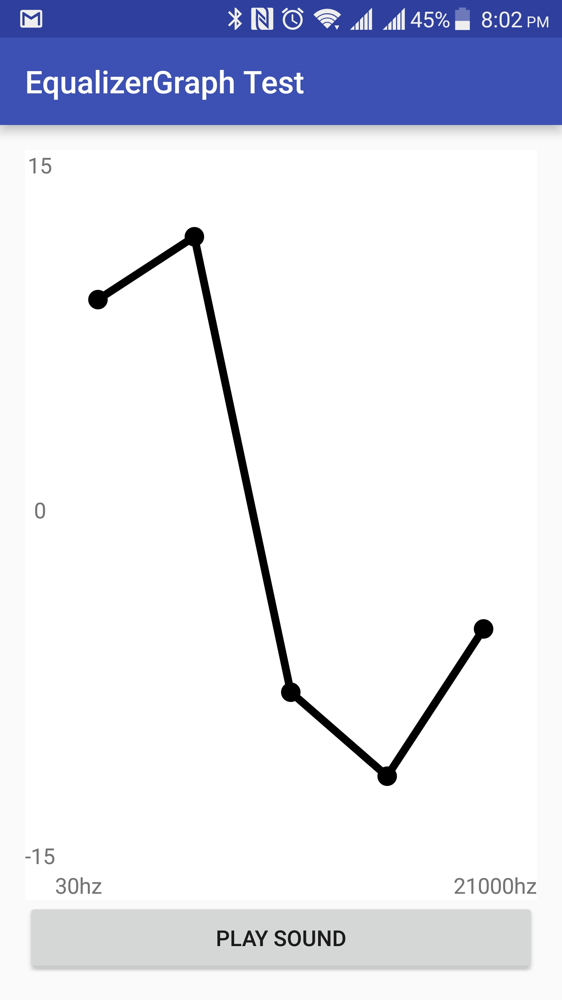
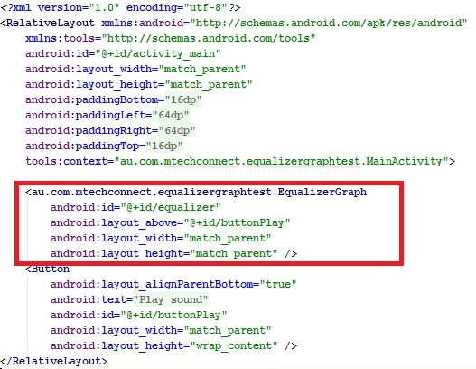

# EqualizerGraph
This is a control which attaches to the Equalizer class (android.media.audiofx.Equalizer). The equalizer can then be controlled though the line graph style control.

The control will have a dragable point for each equalizer band and will get the max/min gain and max/min frequency from the equalizer class.
The values (seleted points on the graph) will be automatically saved for the next time the control is loaded. You can also save values by name using saveSettings and LoadSettings.

<h1>How to add to your Android project</h1>
1. Add the <a href="https://github.com/ClintonPadgett/EqualizerGraph/blob/master/app/src/main/java/au/com/mtechconnect/equalizergraphtest/EqualizerGraph.java">EqualizerGraph</a> and <a href="https://github.com/ClintonPadgett/EqualizerGraph/blob/master/app/src/main/java/au/com/mtechconnect/equalizergraphtest/VerticalSeekBar.java">VerticalSeekBar<a/> classes into your project.
2. Add the <a href="https://github.com/ClintonPadgett/EqualizerGraph/blob/master/app/src/main/res/layout/equlaizer_graph.xml">equalizer_graph.xml</a>  layout to your layout folder.
3. Create a string resourse "frequency" and set the value to "%1$dhz" (or replace hz as required).
4. Build the project.
5. Add the EqulaizerGraph view to your layout 

6. Create an instance of EqualizerGraph 
<code>EqualizerGraph eq = (EqualizerGraph) findViewById(R.id.equalizer);</code>
7. Attach the EqualizerGraph to your AudioTrack 
<code>eq.attachToAudioTrack(audioTrack.getAudioSessionId());</code>

That's it, you're done.
   
